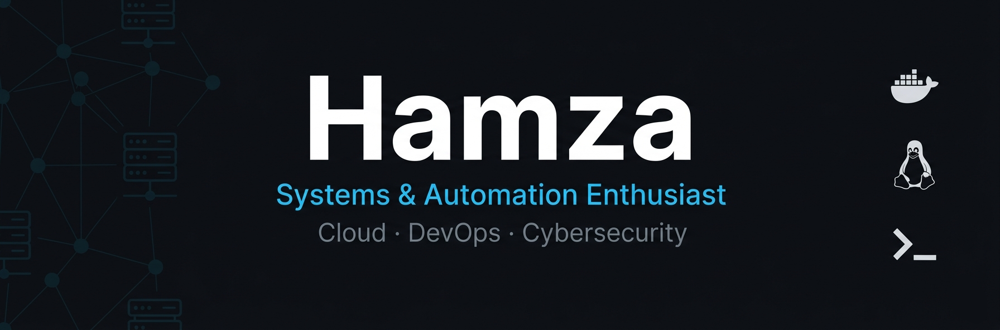

  

<h1 align="center">¡Hola! Soy Hamza 👋</h1>
<h3 align="center">Systems & Automation Enthusiast | Exploring Cloud & DevOps ☁️</h3>

 

### 👨‍💻 Sobre Mí

- 🚀 Apasionado por construir pipelines e infraestructuras automatizadas.
- 🔭 **En desarrollo:** Creando un script automatizado para desplegar un entorno de servicios con **Docker, n8n, Postgres y Whisper**. (¡Pronto en mis repositorios!)
- 🌱 Explorando y aprendiendo continuamente sobre **Cloud, DevOps y Ciberseguridad**.
- 💡 Me apasiona la eficiencia, dominar la terminal de Linux y levantar entornos desde cero.
- 🗣️ **Idiomas:** Español 🇪🇸 (Nativo) · Árabe 🇲🇦 (Nativo) · Catalán 🏴 (Nativo) · Inglés 🇬🇧 (B1)
- 🧠 **Soft Skills:** Resolución de problemas complejos · Trabajo autónomo · Pensamiento analítico · Ganas de crecer
- 📫 Contacto: **[Tu Email o LinkedIn aquí]**

---

### 🛠️ Tecnologías y Herramientas

**🐧 Sistemas Operativos y Entornos**  

  

**☁️ Infraestructura y Contenedores**  

  

**🗄️ Bases de Datos**  

  

**💻 Scripting & Terminal**  

  

**🛠️ Herramientas y Ciberseguridad**  

  

> **Ecosistema Adicional:** **`n8n`** (Automatización), `Podman`, `Docker Networks`, `ZSH`, Administración de Redes y Sistemas.

---

### 🚀 Últimos Proyectos Públicos

*(Esta lista se actualiza mágicamente cada noche con tus proyectos públicos más recientes gracias a GitHub Actions)*

<!-- START_LATEST_REPOS -->

  <i>
🚀 Tus repositorios públicos más recientes aparecerán aquí automáticamente cada noche.
</i>

<!-- END_LATEST_REPOS -->

---

### ⭐ Mis Proyectos Destacados (Selección Especial)

*(¡Tú decides qué proyectos aparecen aquí sin editar este texto!)*

<!-- START_FEATURED_REPOS -->

  <i>
⭐ Añade el topic <b>destacado</b> a cualquier repositorio tuyo y aparecerá aquí automáticamente.
</i>

<!-- END_FEATURED_REPOS -->

---

### 📈 Estadísticas y Actividad

  

 

  <picture>
    <source media="(prefers-color-scheme: dark)" srcset="https://raw.githubusercontent.com/Hamza-Cloud-DevOPS/Hamza-Cloud-DevOPS/output/github-contribution-grid-snake-dark.svg">
    <source media="(prefers-color-scheme: light)" srcset="https://raw.githubusercontent.com/Hamza-Cloud-DevOPS/Hamza-Cloud-DevOPS/output/github-contribution-grid-snake.svg">
    
  </picture>

---

### 🤝 Conecta Conmigo

<table width="100%" border="0" cellspacing="0" cellpadding="0">
  <tr>
    <td width="50%" align="center">
      
    </td>
    <td width="50%" align="center">
      
    </td>
  </tr>
</table>
